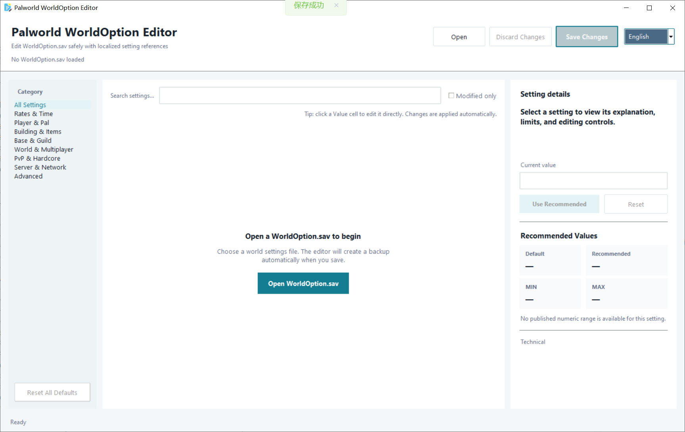
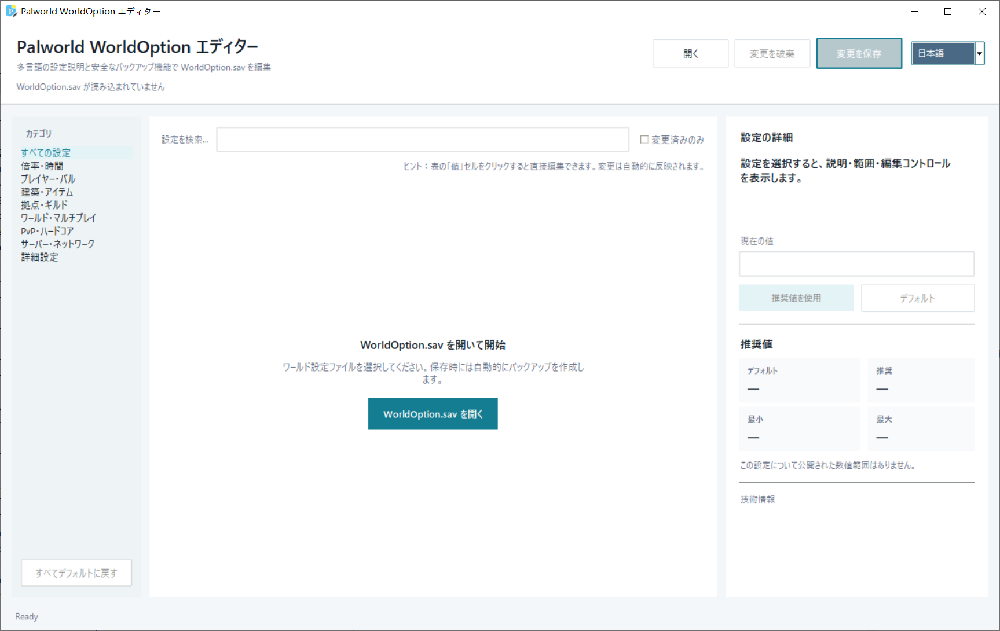
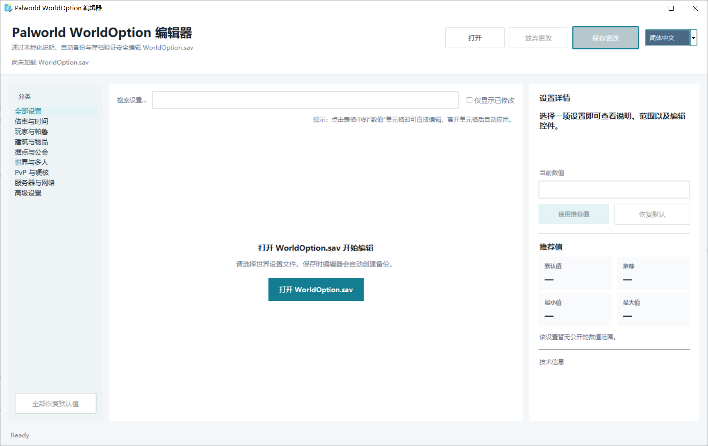

<div align="center"></div>
# Palworld WorldOption Editor

**[English](#english)** · **[日本語](#japanese)** · **[简体中文](#chinese)**

A lightweight Windows desktop editor for Palworld `WorldOption.sav` files, with full setting visualization, multilingual descriptions, automatic backups, and save-integrity checks.

> Community project. Not affiliated with or endorsed by Pocketpair.

---
<a id="english"></a>
# English

## Overview
<div align="center"></div>

Palworld WorldOption Editor provides a graphical interface for viewing and editing the settings stored in `WorldOption.sav`.

The application is designed for local Palworld save data and opens only files named `WorldOption.sav`. The default file browser location is:

```text
%LocalAppData%\Pal\Saved\SaveGames
```

## Features

- Displays every setting found in `OptionWorldData.Settings`
- Localized setting names and explanations in:
  - English
  - Japanese
  - Simplified Chinese
- Runtime language switching
- Responsive layout for longer translated text
- Search/filter across setting names, keys, and localized descriptions
- **Reset to Default** support for known Palworld defaults
- Automatic backup before every save
- Sequential backup naming:
  - `WorldOption.sav.bak`
  - `WorldOption.sav.bak01`
  - `WorldOption.sav.bak02`
  - ...
- Detects changes made to the save file after it was opened
- Validates serialized GVAS data before replacing the original file
- Supports classic `PlZ` saves and modern `PlM`/Oodle-compressed saves

## Requirements

- Windows
- Python 3.10 or newer
- Tkinter
- `palworld-save-tools`
- `pyooz`

Install the required Python packages:

```powershell
python -m pip install --upgrade palworld-save-tools pyooz
```

Tkinter is normally included with the standard Python installer for Windows.

You can verify it with:

```powershell
python -m tkinter
```

## Running

```powershell
python palworld_worldoption_editor.py
```

Open the required `WorldOption.sav`, edit the desired settings, and select **Save**.

Close Palworld before editing or replacing a save file.

## Save and Backup Behavior

A backup is created every time the editor saves.

Existing backups are never overwritten. The editor selects the next available filename automatically:

```text
WorldOption.sav.bak
WorldOption.sav.bak01
WorldOption.sav.bak02
WorldOption.sav.bak03
...
```

The application also verifies the generated save before replacing the original file.

Keeping an additional manual backup of the complete world save folder is strongly recommended.

## Save Format Notes

Palworld save files contain Unreal Engine GVAS data inside a Palworld compression container.

This editor:

1. Detects the save container.
2. Decompresses the GVAS payload.
3. Parses `OptionWorldData.Settings`.
4. Modifies only the requested setting values.
5. Serializes and validates the GVAS data.
6. Recompresses and verifies the resulting save.
7. Creates a backup before replacing the original file.

`pyooz` provides Oodle decompression for `PlM` input. Because it is a decompression library, edited `PlM` saves are written using Palworld-compatible `PlZ2` double-zlib compression.

## Important

Editing save files always carries some risk. Back up your world before making changes.

Some settings can have significant effects on an existing world when reduced below its current usage, including building limits, base limits, guild limits, and similar capacity settings.

---
<a id="japanese"></a>
# 日本語

## 概要
<div align="center"></div>

Palworld WorldOption Editor は、Palworld の `WorldOption.sav` に保存されているワールド設定を確認・編集するための Windows 向け GUI ツールです。

このアプリケーションは `WorldOption.sav` という名前のファイルのみを開きます。ファイル選択画面の初期フォルダーは次の場所です。

```text
%LocalAppData%\Pal\Saved\SaveGames
```

## 主な機能

- `OptionWorldData.Settings` に含まれるすべての設定を表示
- 各設定の名称と説明を以下の言語で表示
  - English
  - 日本語
  - 简体中文
- アプリ内で言語を即時切り替え
- 長い翻訳文でも切れにくいレスポンシブレイアウト
- 設定名、内部キー、各言語の説明を対象とした検索・フィルター
- 既知の Palworld 標準値に戻す **「デフォルトに戻す」** 機能
- 保存時に必ず自動バックアップを作成
- バックアップを連番で保存
  - `WorldOption.sav.bak`
  - `WorldOption.sav.bak01`
  - `WorldOption.sav.bak02`
  - ...
- ファイルを開いた後に外部で変更された場合を検出
- 元ファイルを置き換える前に GVAS のシリアライズ結果を検証
- 従来の `PlZ` と新しい `PlM` / Oodle 圧縮形式に対応

## 必要環境

- Windows
- Python 3.10 以降
- Tkinter
- `palworld-save-tools`
- `pyooz`

必要な Python パッケージをインストールします。

```powershell
python -m pip install --upgrade palworld-save-tools pyooz
```

Tkinter は通常、Windows 用の標準 Python インストーラーに含まれています。

確認するには次を実行してください。

```powershell
python -m tkinter
```

## 実行方法

```powershell
python palworld_worldoption_editor.py
```

対象の `WorldOption.sav` を開き、必要な設定を変更して **「保存」** を選択します。

セーブデータを編集・置換する前に Palworld を終了してください。

## 保存とバックアップ

保存するたびにバックアップを作成します。

既存のバックアップは上書きせず、使用されていない次のファイル名を自動的に選択します。

```text
WorldOption.sav.bak
WorldOption.sav.bak01
WorldOption.sav.bak02
WorldOption.sav.bak03
...
```

また、生成したセーブデータを検証してから元の `WorldOption.sav` を置き換えます。

自動バックアップとは別に、ワールドのセーブフォルダー全体を手動でバックアップしておくことを推奨します。

## セーブ形式について

Palworld のセーブファイルは、Palworld 独自の圧縮コンテナ内に Unreal Engine の GVAS データを格納しています。

本ツールでは次の手順で処理します。

1. セーブ形式を判定
2. GVAS データを展開
3. `OptionWorldData.Settings` を解析
4. 指定された設定値のみを変更
5. GVAS を再生成して検証
6. 再圧縮したセーブデータを検証
7. バックアップを作成してから元ファイルを置換

`PlM` 入力の Oodle 展開には `pyooz` を使用します。`pyooz` は展開用ライブラリのため、編集後の `PlM` セーブは Palworld 互換の `PlZ2` 二重 zlib 形式で保存されます。

## 注意事項

セーブデータの編集には常に一定のリスクがあります。変更前に必ずバックアップを作成してください。

建築上限、拠点上限、ギルド上限など、一部の設定を現在の使用量より低い値へ変更すると、既存ワールドに大きな影響を与える場合があります。

---
<a id="chinese"></a>
# 简体中文

## 概述
<div align="center"></div>

Palworld WorldOption Editor 是一个用于查看和编辑 Palworld `WorldOption.sav` 世界设置的 Windows 图形界面工具。

程序只允许打开名为 `WorldOption.sav` 的文件。文件选择器默认从以下目录开始：

```text
%LocalAppData%\Pal\Saved\SaveGames
```

## 功能

- 显示 `OptionWorldData.Settings` 中存在的全部设置
- 每个设置均提供以下语言的名称与说明：
  - English
  - 日本語
  - 简体中文
- 可在程序运行时切换语言
- 自适应界面，避免较长的日文或中文文本被截断
- 可按设置名称、内部键名及多语言说明进行搜索和筛选
- 对已知 Palworld 默认值提供 **“恢复默认值”** 功能
- 每次保存前自动创建备份
- 备份文件按顺序命名：
  - `WorldOption.sav.bak`
  - `WorldOption.sav.bak01`
  - `WorldOption.sav.bak02`
  - ...
- 检测文件打开后是否被其他程序修改
- 替换原文件前验证序列化后的 GVAS 数据
- 支持传统 `PlZ` 以及较新的 `PlM` / Oodle 压缩存档

## 环境要求

- Windows
- Python 3.10 或更高版本
- Tkinter
- `palworld-save-tools`
- `pyooz`

安装所需 Python 软件包：

```powershell
python -m pip install --upgrade palworld-save-tools pyooz
```

Windows 标准版 Python 安装程序通常已经包含 Tkinter。

可通过以下命令检查：

```powershell
python -m tkinter
```

## 运行

```powershell
python palworld_worldoption_editor.py
```

打开目标 `WorldOption.sav`，修改需要的设置，然后选择 **“保存”**。

编辑或替换存档前，请先完全关闭 Palworld。

## 保存与备份

编辑器每次保存时都会创建新的备份文件。

已有备份不会被覆盖，程序会自动选择下一个可用文件名：

```text
WorldOption.sav.bak
WorldOption.sav.bak01
WorldOption.sav.bak02
WorldOption.sav.bak03
...
```

生成的新存档通过验证后，程序才会替换原始 `WorldOption.sav`。

除自动备份外，建议另外手动备份整个世界存档目录。

## 存档格式说明

Palworld 存档在游戏使用的压缩容器中保存 Unreal Engine GVAS 数据。

本工具按以下流程处理：

1. 检测存档容器格式
2. 解压 GVAS 数据
3. 解析 `OptionWorldData.Settings`
4. 仅修改指定的设置值
5. 重新序列化并验证 GVAS
6. 重新压缩并验证生成的存档
7. 创建备份后替换原文件

`PlM` 输入使用 `pyooz` 进行 Oodle 解压。由于 `pyooz` 是解压库，编辑后的 `PlM` 存档会使用 Palworld 兼容的 `PlZ2` 双层 zlib 格式保存。

## 注意事项

修改存档文件始终存在一定风险。进行任何更改前，请先备份世界存档。

如果将建筑数量、据点数量、公会容量等限制降低到当前世界实际使用量以下，可能会对现有世界产生明显影响。

---

# Acknowledgements / 謝辞 / 致谢

This project was developed with reference to publicly available documentation and implementation details from the following community projects. Their work has been valuable for understanding Palworld save structures, GVAS serialization, and compression formats.

本プロジェクトでは、Palworld のセーブ構造、GVAS のシリアライズ、圧縮形式を理解するため、以下のコミュニティプロジェクトで公開されているドキュメントおよび実装を参考にしています。各プロジェクトの作者・貢献者に感謝します。

本项目在开发过程中参考了以下社区项目公开提供的文档和实现，用于理解 Palworld 存档结构、GVAS 序列化以及压缩格式。感谢各项目作者和贡献者的工作。

- **cheahjs/palworld-save-tools**  
  Palworld SAV/GVAS parsing and serialization.  
  Palworld SAV/GVAS の解析・シリアライズ。  
  Palworld SAV/GVAS 解析与序列化。  
  https://github.com/cheahjs/palworld-save-tools

- **zao/pyooz**  
  Python bindings for Oodle-compatible decompression.  
  Oodle 互換データ展開用 Python バインディング。  
  Oodle 兼容解压的 Python 绑定。  
  https://github.com/zao/pyooz

- **Dehmahk/Palworld-WorldOption-Editor**  
  Reference implementation and documentation for `WorldOption.sav` editing and Palworld compression handling.  
  `WorldOption.sav` 編集および Palworld 圧縮処理に関する実装・ドキュメントの参考。  
  `WorldOption.sav` 编辑与 Palworld 压缩处理方面的实现和文档参考。  
  https://github.com/Dehmahk/Palworld-WorldOption-Editor

- **Luckisugar/PalWorld-Microsoft-Store-WorldOption.sav-Editor**  
  Reference material for WorldOption editing, backup behavior, and modern Palworld save containers.  
  WorldOption 編集、バックアップ処理、近年の Palworld セーブ形式に関する参考資料。  
  WorldOption 编辑、备份机制及现代 Palworld 存档容器方面的参考资料。  
  https://github.com/Luckisugar/PalWorld-Microsoft-Store-WorldOption.sav-Editor

- **deafdudecomputers/PalworldSaveTools / PalSav-Flex**  
  Additional reference for modern Palworld save parsing and Oodle-related format support.  
  最新の Palworld セーブ解析および Oodle 関連形式対応に関する追加参考資料。  
  现代 Palworld 存档解析及 Oodle 相关格式支持方面的补充参考。  
  https://github.com/deafdudecomputers/PalworldSaveTools

Please review and comply with the licenses of the referenced projects when reusing or redistributing their code.

各プロジェクトのコードを再利用・再配布する場合は、それぞれのライセンスをご確認ください。

如需复用或重新分发上述项目的代码，请遵守各项目对应的许可证。

---

## Trademark Notice / 商標について / 商标声明

Palworld and related names are trademarks or registered trademarks of their respective owners. This project is an independent community utility and is not affiliated with Pocketpair.

Palworld および関連名称は、それぞれの権利者に帰属する商標または登録商標です。本プロジェクトは独立したコミュニティツールであり、Pocketpair とは関係ありません。

Palworld 及相关名称的商标权归其各自权利人所有。本项目为独立社区工具，与 Pocketpair 无隶属或合作关系。
